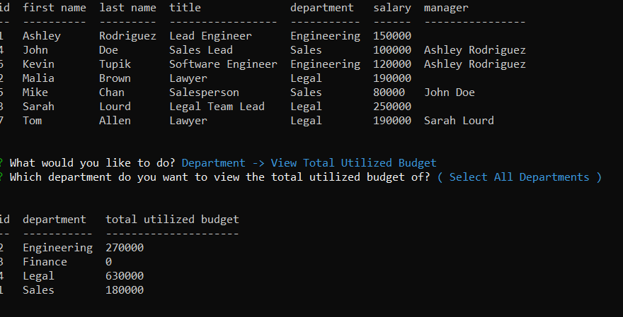

# Employee Tracker

## Description
Employee Tracker is a command-line Node.js application that helps users view and manage the departments, roles, and employees within their company.  

## Application Demo

Employee Functionality:<br><br>
<br><br>

Role Functionality:<br><br>
<br><br>

Department and Total Utilized Budget Functionality:<br><br>
<br><br>

## Table of Contents 

- [Installation Instructions](#installation-instructions)
- [Usage Guidelines](#usage-guidelines)

## Installation Instructions

- #### Node.js  
This application needs Node.js to execute. To install Node.js, run the appropriate installer from https://nodejs.org/en/download/ and follow the prompts to complete the installation. 

- #### Clone this repo
 Clone this repo to your local machine using:
```shell
git clone `https://github.com/Gveetil/Node-Employee-Tracker.git`
```

- #### Install packages
You will also need to install the below npm packages to your environment:
 - mysql
 - inquirer
 - dotenv
 - boxen
 - figlet
 - console.table<br><br>
 
 Browse to the folder where you cloned the Repo and install the packages:
```shell
$ npm install 
```

- #### MySql database
This application uses a MySql backend database to store data. 
<br>
To create a sample database:<br>

 Browse to the `db` folder inside the folder where you cloned the Repo.<br>
 Start the MySQL command line tool and execute the `schema.sql` and `seeds.sql` files<br><br>

 > 
 > This can be done as below : 
 >
 > ```shell
 > $ mysql -u <user_name> -p  
 >
 > mysql> source schema.sql
 >
 > mysql> source seeds.sql
 > ```

 The database should now be ready for use.

- #### Env settings
 The database connection settings for this application needs to be configured in the .env file. <br><br>
  To configure the database connection in the .env file:
   
   Browse to the folder where you cloned the Repo and create a file named .env
   
   Open this file, add the below keys and save:
```
MYSQL_PORT=3306
MYSQL_HOST=localhost
MYSQL_USER=<your-database-user-name>
MYSQL_PASSWORD=<your-database-password>
MYSQL_DATABASE=employee_db
```

- #### Execute the program
To run the program, browse to the local folder where you cloned the Repo and execute 
```shell
$ npm start 
```
The app should now start executing.<br><br>

## Usage Guidelines

- When the application is executed, the user is prompted to select from the below list of actions:
    * Employee -> View All
    * Employee -> View By Department
    * Employee -> View By Manager
    * Employee -> Add
    * Employee -> Remove
    * Employee -> Update Role
    * Employee -> Update Manager
    * Role -> View All
    * Role -> Add
    * Role -> Remove
    * Department -> View All
    * Department -> Add
    * Department -> Remove
    * Department -> View Total Utilized Budget
    * \>\> Exit Application >><br><br>


- If the user chooses a `view` action, the application displays the requested data as a table<br><br>
 
 <br><br>

- If the user chooses an `add` action, the application prompts the user for the data to be added. Once the data is entered, the employee database is updated accordingly and a success message is displayed.<br><br>
 
 <br><br>

- If the user chooses delete, the application asks the user to choose the record to delete. The application then deletes the required record and displays a success / failure message. <br><br>
 
 <br><br>

- If the user chooses update, the application asks the user to choose the record to update, and the changes to make. The application then updates the required record and displays a success message.<br><br>
 
 <br><br>

- If the user chooses to view the Total Utilized Budget, the application asks the user to select a department, or the `Select All Departments` option, and then displays the requested data as a table.<br><br>
 
 <br><br>